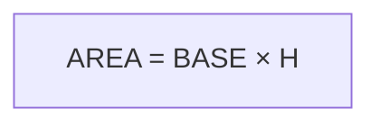

# LEZIONE 2 - Flow Chart e Costrutti Base
**Durata: 4 ore | Teoria: 2h | Esercizi: 2h**

---

## PARTE TEORICA (2 ore)

### 2.1 Introduzione ai Diagrammi di Flusso (20 min)

#### Cos'è un Flow Chart?
Un **diagramma di flusso** (flow chart o flowchart) è una rappresentazione grafica di un algoritmo che utilizza simboli geometrici standardizzati collegati da frecce per mostrare il flusso di esecuzione.

#### Perché usare i Flow Chart?
- **Visualizzazione**: rappresentazione visiva più chiara rispetto al testo
- **Comunicazione**: facile da condividere con altri programmatori
- **Progettazione**: aiuta a pensare alla logica prima di scrivere codice
- **Documentazione**: documenta il funzionamento di un programma
- **Debug**: facilita l'individuazione di errori logici

#### Vantaggi e Svantaggi

**Vantaggi:**
- Indipendenti dal linguaggio di programmazione
- Facili da comprendere anche per non programmatori
- Evidenziano chiaramente i punti decisionali
- Utili per programmi di media complessità

**Svantaggi:**
- Possono diventare troppo complessi per programmi grandi
- Richiedono tempo per essere disegnati
- Difficili da modificare su carta

---

### 2.2 Simboli dei Flow Chart (30 min)

#### Simboli Fondamentali

**1. TERMINATORE (Ovale/Ellisse)**

- Indica l'**inizio** o la **fine** di un algoritmo
- Ogni flow chart ha esattamente UN inizio e almeno UNA fine

**2. PROCESSO (Rettangolo)**

- Rappresenta un'**operazione** o **istruzione**
- Calcoli, assegnazioni, operazioni matematiche
- Esempi: `X = 5`, `SOMMA = A + B`, `CONTATORE = CONTATORE + 1`

**3. INPUT/OUTPUT (Parallelogramma)**
```
    ╱────────────────╲
   ╱  Leggi NUMERO    ╲
  ╱____________________╲
  
    ╱────────────────╲
   ╱  Scrivi TOTALE   ╲
  ╱____________________╲
```
- Rappresenta **input** (lettura di dati)
- Rappresenta **output** (scrittura/stampa di risultati)
- Esempi: `Leggi N`, `Scrivi "Risultato"`, `Stampa MEDIA`

**4. DECISIONE (Rombo)**
```
        ╱╲
       ╱  ╲
      ╱ N>0╲
     ╱  ?   ╲
    ╱________╲
   SI        NO
```
- Rappresenta una **condizione** o **test**
- Ha due uscite: VERO (SI/TRUE) e FALSO (NO/FALSE)
- La condizione è sempre una domanda con risposta SI/NO
- Esempi: `N > 0?`, `A = B?`, `SOMMA < 100?`

**5. FRECCE (Linee di Flusso)**
```
    │
    ↓
    →
    ←
    ↑
```
- Indicano il **flusso di esecuzione**
- Mostrano l'ordine in cui vengono eseguite le istruzioni
- Di solito vanno dall'alto verso il basso e da sinistra a destra

**6. CONNETTORI (Cerchi)**
```
    ┌───┐
    │ A │  (Connettore in-page)
    └───┘
    
    ┌───┐
    │ 1 │  (Connettore off-page)
    └───┘
```
- Usati per **collegare** parti del flow chart quando le frecce si incrocerebbero
- Connettori con la stessa etichetta sono collegati
- Utili per mantenere il diagramma leggibile

#### Simboli Aggiuntivi (Meno Comuni)

**7. PREDEFINITO (Rettangolo con barre laterali)**
```
    ┃─────────────┃
    ┃  Funzione   ┃
    ┃─────────────┃
```
- Rappresenta una **funzione** o **procedura** predefinita

**8. PREPARAZIONE (Esagono)**
```
      ______
     /      \
    |  FOR  |
     \______/
```
- Usato per indicare **cicli** con contatore (FOR)

---

### 2.3 Regole per Disegnare Flow Chart (15 min)

#### Convenzioni Standard

1. **Direzione del flusso**: dall'alto verso il basso, da sinistra a destra
2. **Un solo inizio**: un unico terminatore "INIZIO"
3. **Una o più fine**: almeno un terminatore "FINE"
4. **Frecce chiare**: sempre indicare la direzione con frecce
5. **Etichette decisioni**: indicare chiaramente SI/NO o VERO/FALSO
6. **Testo conciso**: istruzioni brevi e chiare nei simboli
7. **No incroci**: evitare che le linee si incrocino (usare connettori)
8. **Allineamento**: mantenere i simboli allineati per leggibilità

#### Esempio Completo: Calcolare la Media di Due Numeri

```
        ┌─────────┐
        │ INIZIO  │
        └────┬────┘
             │
        ╱────┴────╲
       ╱  Leggi A  ╲
      ╱______________╲
             │
        ╱────┴────╲
       ╱  Leggi B  ╲
      ╱______________╲
             │
      ┌──────┴──────┐
      │ SOMMA = A+B │
      └──────┬──────┘
             │
      ┌──────┴──────┐
      │ MEDIA=SOMMA/2│
      └──────┬──────┘
             │
        ╱────┴────╲
       ╱Scrivi MEDIA╲
      ╱______________╲
             │
        ┌────┴────┐
        │  FINE   │
        └─────────┘
```

---

### 2.4 Costrutti Fondamentali (35 min)

I costrutti fondamentali sono i **mattoni** con cui si costruisce qualsiasi algoritmo. Secondo il **Teorema di Böhm-Jacopini** (1966), qualsiasi algoritmo può essere espresso usando solo tre costrutti di base.

#### 1. SEQUENZA

**Definizione:** Esecuzione di istruzioni una dopo l'altra, in ordine.

**Caratteristiche:**
- Le istruzioni vengono eseguite dall'alto verso il basso
- Ogni istruzione viene eseguita esattamente una volta
- Non ci sono scelte o ripetizioni

**Flow Chart - Esempio: Scambio di due variabili**
```
        ┌─────────┐
        │ INIZIO  │
        └────┬────┘
             │
        ╱────┴────╲
       ╱  Leggi A  ╲
      ╱______________╲
             │
        ╱────┴────╲
       ╱  Leggi B  ╲
      ╱______________╲
             │
      ┌──────┴──────┐
      │   TEMP = A  │
      └──────┬──────┘
             │
      ┌──────┴──────┐
      │   A = B     │
      └──────┬──────┘
             │
      ┌──────┴──────┐
      │   B = TEMP  │
      └──────┬──────┘
             │
        ╱────┴────╲
       ╱ Scrivi A  ╲
      ╱______________╲
             │
        ╱────┴────╲
       ╱ Scrivi B  ╲
      ╱______________╲
             │
        ┌────┴────┐
        │  FINE   │
        └─────────┘
```

#### 2. SELEZIONE (o Alternativa)

**Definizione:** Esecuzione di istruzioni diverse in base a una condizione.

**Tipi di Selezione:**

**a) Selezione Semplice (IF)**
```
        ┌─────────┐
        │ INIZIO  │
        └────┬────┘
             │
        ╱────┴────╲
       ╱  Leggi N  ╲
      ╱______________╲
             │
          ╱──┴──╲
         ╱ N > 0 ╲
        ╱____?____╲
       SI│        │NO
         │        └──────┐
      ┌──┴────┐         │
      │Scrivi │         │
      │"Positivo"│      │
      └──┬────┘         │
         │              │
         └──────┬───────┘
             ┌──┴──┐
             │FINE │
             └─────┘
```

**b) Selezione Binaria (IF-ELSE)**
```
        ┌─────────┐
        │ INIZIO  │
        └────┬────┘
             │
        ╱────┴────╲
       ╱  Leggi N  ╲
      ╱______________╲
             │
          ╱──┴──╲
         ╱ N % 2 ╲
        ╱  = 0?  ╲
       SI│        │NO
         │        │
      ┌──┴────┐ ┌┴──────┐
      │Scrivi │ │Scrivi │
      │"Pari" │ │"Dispari"│
      └──┬────┘ └┬──────┘
         │       │
         └───┬───┘
          ┌──┴──┐
          │FINE │
          └─────┘
```

**c) Selezione Multipla (Nidificata)**
```
        ┌─────────┐
        │ INIZIO  │
        └────┬────┘
             │
        ╱────┴────╲
       ╱  Leggi N  ╲
      ╱______________╲
             │
          ╱──┴──╲
         ╱ N > 0 ╲
        ╱____?____╲
       SI│        │NO
         │     ╱──┴──╲
         │    ╱ N < 0 ╲
         │   ╱____?____╲
         │  SI│        │NO
         │    │        │
      ┌──┴──┐ ┌┴────┐ ┌┴────┐
      │"Pos"│ │"Neg"│ │"Zero"│
      └──┬──┘ └┬────┘ └┬────┘
         └─────┴───────┘
          ┌──┴──┐
          │FINE │
          └─────┘
```

#### 3. ITERAZIONE (o Ciclo o Loop)

**Definizione:** Ripetizione di un blocco di istruzioni finché una condizione è vera.

**Tipi di Iterazione:**

**a) WHILE (Condizione all'inizio)**
- Controlla la condizione PRIMA di eseguire il blocco
- Se la condizione è falsa inizialmente, il blocco non viene mai eseguito

**Esempio: Contare da 1 a 5**
```
        ┌─────────┐
        │ INIZIO  │
        └────┬────┘
             │
      ┌──────┴──────┐
      │  CONT = 1   │
      └──────┬──────┘
             │
      ┌──────┴──────┐
      │      ●      │◄──────┐
      └──────┬──────┘       │
             │               │
          ╱──┴──╲           │
         ╱ CONT ╲           │
        ╱  <= 5  ╲          │
       SI│   ?    │NO       │
         │        └──────┐  │
    ╱────┴────╲         │  │
   ╱Scrivi CONT╲        │  │
  ╱______________╲       │  │
         │               │  │
    ┌────┴────┐         │  │
    │CONT=CONT│         │  │
    │   +1    │         │  │
    └────┬────┘         │  │
         └──────────────┘  │
                │          │
             ┌──┴──┐       │
             │FINE │       │
             └─────┘       │
```

**b) DO-WHILE (Condizione alla fine)**
- Esegue il blocco PRIMA di controllare la condizione
- Il blocco viene eseguito almeno una volta

**Esempio: Validazione input (ripeti finché valido)**
```
        ┌─────────┐
        │ INIZIO  │
        └────┬────┘
             │
      ┌──────┴──────┐
      │      ●      │◄──────┐
      └──────┬──────┘       │
             │               │
        ╱────┴────╲          │
       ╱  Leggi N  ╲         │
      ╱______________╲        │
             │               │
          ╱──┴──╲           │
         ╱ N < 1 ╲          │
        ╱   OR    ╲         │
       ╱  N > 10  ╱         │
      ╱     ?    ╱          │
     SI│        │NO         │
       │        └──────┐    │
  ╱────┴────╲         │    │
 ╱Scrivi"Errore"╲     │    │
╱________________╲     │    │
       │               │    │
       └───────────────┘    │
                            │
                      ┌─────┴────┐
                      │   FINE   │
                      └──────────┘
```

**c) FOR (Ciclo con contatore)**
- Usato quando si conosce in anticipo il numero di ripetizioni
- Combina inizializzazione, condizione e incremento

**Esempio: Somma dei primi N numeri**
```
        ┌─────────┐
        │ INIZIO  │
        └────┬────┘
             │
        ╱────┴────╲
       ╱  Leggi N  ╲
      ╱______________╲
             │
      ┌──────┴──────┐
      │  SOMMA = 0  │
      └──────┬──────┘
             │
      ┌──────┴──────┐
      │    I = 1    │
      └──────┬──────┘
             │
      ┌──────┴──────┐
      │      ●      │◄──────┐
      └──────┬──────┘       │
             │               │
          ╱──┴──╲           │
         ╱  I <=  ╲          │
        ╱    N     ╲         │
       SI│   ?      │NO      │
         │          └────┐   │
    ┌────┴────┐         │   │
    │SOMMA=   │         │   │
    │SOMMA+I  │         │   │
    └────┬────┘         │   │
         │              │   │
    ┌────┴────┐         │   │
    │ I = I+1 │         │   │
    └────┬────┘         │   │
         └──────────────┘   │
                            │
                       ╱────┴────╲
                      ╱Scrivi SOMMA╲
                     ╱______________╲
                            │
                        ┌───┴───┐
                        │ FINE  │
                        └───────┘
```

---

### 2.5 Pseudocodice (20 min)

#### Cos'è lo Pseudocodice?

Lo **pseudocodice** è un linguaggio di descrizione degli algoritmi che sta a metà strada tra il linguaggio naturale e un linguaggio di programmazione.

#### Caratteristiche:
- Non è un linguaggio di programmazione vero
- Non ha una sintassi rigida
- È più strutturato del linguaggio naturale
- Facilita la traduzione in codice reale
- Indipendente dal linguaggio di programmazione

#### Parole Chiave Comuni

**Struttura base:**
```
INIZIO
    istruzioni
FINE
```

**Input/Output:**
```
LEGGI variabile
SCRIVI variabile
STAMPA "messaggio"
```

**Assegnamento:**
```
variabile ← valore
variabile = espressione
```

**Selezione:**
```
SE condizione ALLORA
    istruzioni
FINE SE

SE condizione ALLORA
    istruzioni1
ALTRIMENTI
    istruzioni2
FINE SE
```

**Iterazione:**
```
MENTRE condizione FARE
    istruzioni
FINE MENTRE

RIPETI
    istruzioni
FINCHÉ condizione

PER variabile DA inizio A fine FARE
    istruzioni
FINE PER
```

#### Esempi di Pseudocodice

**Esempio 1: Calcolare il fattoriale**
```
INIZIO
    LEGGI n
    fattoriale ← 1
    i ← 1
    MENTRE i <= n FARE
        fattoriale ← fattoriale * i
        i ← i + 1
    FINE MENTRE
    SCRIVI fattoriale
FINE
```

**Esempio 2: Trovare il massimo in un array**
```
INIZIO
    LEGGI n (dimensione array)
    PER i DA 0 A n-1 FARE
        LEGGI array[i]
    FINE PER
    
    max ← array[0]
    PER i DA 1 A n-1 FARE
        SE array[i] > max ALLORA
            max ← array[i]
        FINE SE
    FINE PER
    
    SCRIVI max
FINE
```

**Esempio 3: Numeri pari da 1 a N**
```
INIZIO
    LEGGI n
    i ← 2
    MENTRE i <= n FARE
        SCRIVI i
        i ← i + 2
    FINE MENTRE
FINE
```

---

### 2.6 Dal Flow Chart al Codice (10 min)

#### Processo di Traduzione

1. **Analizza il problema** → capisci cosa deve fare
2. **Disegna il flow chart** → visualizza la logica
3. **Scrivi lo pseudocodice** → struttura l'algoritmo
4. **Traduci in linguaggio** → scrivi il codice vero

#### Esempio Completo: Verifica se un numero è positivo, negativo o zero

**1. Problema:** Leggere un numero e dire se è positivo, negativo o zero.

**2. Flow Chart:**
```
    [INIZIO] → [Leggi N] → <N>0?> → SI → [Scrivi "Positivo"]
                              │                    │
                              NO                   │
                              ↓                    │
                           <N<0?> → SI → [Scrivi "Negativo"]
                              │                    │
                              NO                   │
                              ↓                    │
                        [Scrivi "Zero"]            │
                              │                    │
                              └────────┬───────────┘
                                       ↓
                                    [FINE]
```

**3. Pseudocodice:**
```
INIZIO
    LEGGI numero
    SE numero > 0 ALLORA
        SCRIVI "Positivo"
    ALTRIMENTI SE numero < 0 ALLORA
        SCRIVI "Negativo"
    ALTRIMENTI
        SCRIVI "Zero"
    FINE SE
FINE
```

**4. Codice C (anticipazione):**
```c
#include <stdio.h>

int main() {
    int numero;
    printf("Inserisci un numero: ");
    scanf("%d", &numero);
    
    if (numero > 0) {
        printf("Positivo\n");
    } else if (numero < 0) {
        printf("Negativo\n");
    } else {
        printf("Zero\n");
    }
    
    return 0;
}
```

---

## PARTE PRATICA (2 ore)

### ESERCIZI GUIDATI

#### Esercizio 1: Disegnare Flow Chart Semplici (30 min)

**1.1** Disegna il flow chart per calcolare la somma di due numeri.

**Soluzione:**
```
        ┌─────────┐
        │ INIZIO  │
        └────┬────┘
             │
        ╱────┴────╲
       ╱  Leggi A  ╲
      ╱______________╲
             │
        ╱────┴────╲
       ╱  Leggi B  ╲
      ╱______________╲
             │
      ┌──────┴──────┐
      │ SOMMA = A+B │
      └──────┬──────┘
             │
        ╱────┴────╲
       ╱Scrivi SOMMA╲
      ╱______________╲
             │
        ┌────┴────┐
        │  FINE   │
        └─────────┘
```

**1.2** Disegna il flow chart per determinare se un numero è pari.

**Soluzione:**
```
        ┌─────────┐
        │ INIZIO  │
        └────┬────┘
             │
        ╱────┴────╲
       ╱  Leggi N  ╲
      ╱______________╲
             │
      ┌──────┴──────┐
      │ RESTO=N%2   │
      └──────┬──────┘
             │
          ╱──┴──╲
         ╱ RESTO ╲
        ╱  = 0?  ╲
       SI│        │NO
         │        │
    ╱────┴────╲ ╱┴────────╲
   ╱Scrivi"Pari"╲╱Scrivi"Dispari"╲
  ╱______________╲________________╲
         │        │
         └────┬───┘
          ┌───┴───┐
          │ FINE  │
          └───────┘
```

**1.3** Disegna il flow chart per trovare il maggiore tra due numeri.

**Soluzione:**
```
        ┌─────────┐
        │ INIZIO  │
        └────┬────┘
             │
        ╱────┴────╲
       ╱  Leggi A  ╲
      ╱______________╲
             │
        ╱────┴────╲
       ╱  Leggi B  ╲
      ╱______________╲
             │
          ╱──┴──╲
         ╱ A > B ╲
        ╱____?____╲
       SI│        │NO
         │        │
    ╱────┴────╲ ╱┴───────╲
   ╱ Scrivi A  ╲╱ Scrivi B ╲
  ╱______________╲___________╲
         │        │
         └────┬───┘
          ┌───┴───┐
          │ FINE  │
          └───────┘
```

---

#### Esercizio 2: Flow Chart con Cicli (30 min)

**2.1** Disegna il flow chart per stampare i numeri da 1 a 10.

**Soluzione (con WHILE):**
```
        ┌─────────┐
        │ INIZIO  │
        └────┬────┘
             │
      ┌──────┴──────┐
      │    I = 1    │
      └──────┬──────┘
             │
      ┌──────┴──────┐◄──────┐
      │      ●      │        │
      └──────┬──────┘        │
             │                │
          ╱──┴──╲            │
         ╱ I <= 10╲           │
        ╱____?____╲          │
       SI│        │NO        │
         │        └──────┐   │
    ╱────┴────╲         │   │
   ╱ Scrivi I  ╲        │   │
  ╱______________╲       │   │
         │               │   │
    ┌────┴────┐         │   │
    │ I = I+1 │         │   │
    └────┬────┘         │   │
         └──────────────┘   │
                            │
                      ┌─────┴────┐
                      │   FINE   │
                      └──────────┘
```

**2.2** Disegna il flow chart per calcolare la somma dei primi N numeri naturali.

**Soluzione:**
```
        ┌─────────┐
        │ INIZIO  │
        └────┬────┘
             │
        ╱────┴────╲
       ╱  Leggi N  ╲
      ╱______________╲
             │
      ┌──────┴──────┐
      │  SOMMA = 0  │
      └──────┬──────┘
             │
      ┌──────┴──────┐
      │    I = 1    │
      └──────┬──────┘
             │
      ┌──────┴──────┐◄──────┐
      │      ●      │        │
      └──────┬──────┘        │
             │                │
          ╱──┴──╲            │
         ╱  I <=  ╲           │
        ╱    N     ╲          │
       SI│   ?      │NO       │
         │          └────┐    │
    ┌────┴────┐         │    │
    │SOMMA=   │         │    │
    │SOMMA+I  │         │    │
    └────┬────┘         │    │
         │              │    │
    ┌────┴────┐         │    │
    │ I = I+1 │         │    │
    └────┬────┘         │    │
         └──────────────┘    │
                             │
                        ╱────┴────╲
                       ╱Scrivi SOMMA╲
                      ╱______________╲
                             │
                        ┌────┴────┐
                        │  FINE   │
                        └─────────┘
```

---

#### Esercizio 3: Pseudocodice (30 min)

**3.1** Scrivi lo pseudocodice per calcolare l'area di un cerchio.

**Soluzione:**
```
INIZIO
    LEGGI n
    i ← 1
    MENTRE i <= 10 FARE
        risultato ← n * i
        SCRIVI risultato
        i ← i + 1
    FINE MENTRE
FINE
```

**4.2** Scrivi il pseudocodice per il seguente flow chart che conta i numeri positivi.

Flow Chart: Contare quanti numeri positivi in una sequenza di N numeri
```
[INIZIO] → [Leggi N] → [CONT=0] → [I=1] → ●→ <I<=N?> NO → [Scrivi CONT] → [FINE]
                                            ↑       SI
                                            │       ↓
                                            │   [Leggi NUM]
                                            │       ↓
                                            │   <NUM>0?> NO─┐
                                            │     SI        │
                                            │     ↓         │
                                            │ [CONT=CONT+1] │
                                            │     ↓         │
                                            │     ├─────────┘
                                            │     ↓
                                            │  [I=I+1]
                                            │     ↓
                                            └─────┘
```

**Soluzione:**
```
INIZIO
    LEGGI n
    contatore ← 0
    PER i DA 1 A n FARE
        LEGGI numero
        SE numero > 0 ALLORA
            contatore ← contatore + 1
        FINE SE
    FINE PER
    SCRIVI contatore
FINE
```

**4.3** Scrivi il pseudocodice per validare un voto (deve essere tra 0 e 10).

**Soluzione:**
```
INIZIO
    RIPETI
        LEGGI voto
        SE voto < 0 O voto > 10 ALLORA
            SCRIVI "Voto non valido, riprova"
        FINE SE
    FINCHÉ voto >= 0 E voto <= 10
    
    SCRIVI "Voto accettato:", voto
FINE
```

---

### ESERCIZI AUTONOMI

#### Esercizio 5: Flow Chart Complessi (da svolgere in classe)

**5.1** Disegna il flow chart per un programma che legge 3 numeri e li stampa in ordine crescente.

**Suggerimenti:**
- Usa variabili A, B, C per i tre numeri
- Confronta a coppie e scambia se necessario
- Puoi usare variabili temporanee per lo scambio

**5.2** Disegna il flow chart per calcolare la media di N voti, escludendo il voto più basso e il voto più alto.

**Suggerimenti:**
- Leggi N voti
- Trova il minimo e il massimo
- Calcola la somma totale
- Sottrai min e max dalla somma
- Dividi per (N-2)

**5.3** Disegna il flow chart per verificare se un numero è primo.

**Suggerimenti:**
- Un numero è primo se divisibile solo per 1 e se stesso
- Controlla divisibilità da 2 fino a N-1 (o meglio, fino a √N)
- Se trovi un divisore, non è primo

---

#### Esercizio 6: Pseudocodice Avanzato

**6.1** Scrivi lo pseudocodice per la ricerca sequenziale di un elemento in un array.

**Specifiche:**
- Input: array di N elementi, elemento da cercare
- Output: posizione dell'elemento (o -1 se non trovato)

**6.2** Scrivi lo pseudocodice per invertire un array.

**Specifiche:**
- Input: array di N elementi
- Output: array con elementi in ordine inverso
- Suggerimento: scambia primo con ultimo, secondo con penultimo, ecc.

**6.3** Scrivi lo pseudocodice per il gioco "Indovina il numero".

**Specifiche:**
- Il computer "pensa" un numero tra 1 e 100
- L'utente ha 7 tentativi per indovinarlo
- Dopo ogni tentativo, il computer dice se il numero è più alto o più basso
- Se l'utente indovina, vince; altrimenti perde

---

### ESERCIZI DA SVOLGERE A CASA

**Homework 1:** Disegna il flow chart e scrivi lo pseudocodice per calcolare il massimo comun divisore (MCD) tra due numeri usando l'algoritmo di Euclide.
- Algoritmo: MCD(a,b) = MCD(b, a%b) finché b ≠ 0

**Homework 2:** Disegna il flow chart per convertire un numero decimale in binario.
- Suggerimento: dividi ripetutamente per 2 e memorizza i resti

**Homework 3:** Scrivi lo pseudocodice per ordinare un array di N numeri in ordine crescente (usa il Bubble Sort).
- Confronta elementi adiacenti e scambiali se non in ordine
- Ripeti finché non ci sono più scambi

**Homework 4:** Disegna il flow chart per calcolare la sequenza di Fibonacci fino all'N-esimo termine.
- Fibonacci: F(0)=0, F(1)=1, F(n)=F(n-1)+F(n-2)

**Homework 5:** Scrivi lo pseudocodice per un programma che gestisce un menu con 4 opzioni:
1. Calcola area cerchio
2. Calcola area rettangolo
3. Calcola area triangolo
4. Esci

---

## ESERCIZI DI ANALISI E CORREZIONE

### Esercizio 7: Trova gli Errori

**7.1** Il seguente flow chart ha degli errori logici. Individuali e correggili.

**Flow Chart Errato: Somma numeri positivi**
```
[INIZIO] → [SOMMA=0] → [Leggi N] → <N>0?> SI → [SOMMA=SOMMA+N] → [FINE]
                                      NO↓
                                    [Leggi N]
                                        ↑
                                        └────┘ (ciclo infinito!)
```

**Problemi:**
1. Manca una condizione di uscita dal ciclo
2. Il flusso non è chiaro
3. Non si sa quanti numeri leggere

**Versione Corretta:**
```
[INIZIO] → [SOMMA=0] → [Leggi QUANTI] → [I=1] → ●
                                                  ↓
                                              <I<=QUANTI?> NO → [Scrivi SOMMA] → [FINE]
                                                SI↓
                                              [Leggi N]
                                                  ↓
                                              <N>0?> NO─┐
                                                SI↓     │
                                          [SOMMA=SOMMA+N]│
                                                ↓        │
                                                ├────────┘
                                                ↓
                                             [I=I+1]
                                                ↓
                                                ●
```

**7.2** Correggi il seguente pseudocodice che dovrebbe calcolare la media di N numeri:

**Pseudocodice Errato:**
```
INIZIO
    LEGGI n
    somma ← 0
    PER i DA 1 A n FARE
        LEGGI numero
        somma ← numero
    FINE PER
    media ← somma / i
    SCRIVI media
FINE
```

**Errori:**
1. `somma ← numero` sovrascrive invece di sommare
2. `somma / i` usa i che vale n+1 dopo il ciclo
3. Dovrebbe dividere per n, non per i

**Pseudocodice Corretto:**
```
INIZIO
    LEGGI n
    somma ← 0
    PER i DA 1 A n FARE
        LEGGI numero
        somma ← somma + numero
    FINE PER
    media ← somma / n
    SCRIVI media
FINE
```

---

## APPROFONDIMENTI E CURIOSITÀ

### Storia dei Flow Chart

I diagrammi di flusso furono introdotti da **Frank Gilbreth** nel 1921 per documentare i processi industriali. Nel 1947, **Herman Goldstine** e **John von Neumann** li adattarono per la programmazione. Divennero standard con l'**ANSI** (American National Standards Institute) negli anni '60.

### Diagrammi di Nassi-Shneiderman

Alternativa ai flow chart tradizionali, usano blocchi rettangolari nidificati invece di frecce. Utili per evidenziare la programmazione strutturata.

### Unified Modeling Language (UML)

Nei progetti software moderni, i flow chart sono stati in parte sostituiti da diagrammi UML più sofisticati:
- Diagrammi di attività
- Diagrammi di sequenza
- Diagrammi di stato

### Tool Online per Flow Chart

- **draw.io** (diagrams.net): gratuito, potente
- **Lucidchart**: professionale, con collaborazione
- **Flowgorithm**: specifico per algoritmi, genera anche codice
- **Creately**: semplice e intuitivo
- **Visual Paradigm**: completo ma complesso

---

## RIEPILOGO COSTRUTTI

| Costrutto | Scopo | Quando usarlo |
|-----------|-------|---------------|
| **SEQUENZA** | Eseguire azioni in ordine | Sempre, è la base |
| **IF** | Decidere tra due alternative | Quando hai una scelta binaria |
| **IF nidificato** | Decidere tra più alternative | Quando hai più condizioni da verificare |
| **WHILE** | Ripetere finché condizione vera | Quando non sai quante iterazioni servono |
| **DO-WHILE** | Ripetere almeno una volta | Quando il blocco deve eseguirsi sempre almeno 1 volta |
| **FOR** | Ripetere N volte | Quando sai esattamente quante iterazioni servono |

---

## CHECKLIST PER DISEGNARE FLOW CHART

✓ Hai un solo terminatore "INIZIO"?  
✓ Hai almeno un terminatore "FINE"?  
✓ Tutte le frecce hanno una direzione chiara?  
✓ Ogni rombo decisionale ha esattamente 2 uscite (SI/NO)?  
✓ Non ci sono percorsi che portano a nulla (deadlock)?  
✓ Non ci sono cicli infiniti involontari?  
✓ I nomi delle variabili sono significativi?  
✓ Il flow chart è leggibile e ben spaziato?  
✓ Hai evitato incroci di linee (usando connettori)?  
✓ Ogni simbolo è usato correttamente?

---

## PUNTI CHIAVE DELLA LEZIONE

✓ I **flow chart** visualizzano gli algoritmi usando simboli standard  
✓ I **tre costrutti fondamentali** sono: sequenza, selezione, iterazione  
✓ Qualsiasi algoritmo può essere espresso con questi tre costrutti  
✓ Lo **pseudocodice** è un ponte tra algoritmo e codice  
✓ **WHILE** controlla prima, **DO-WHILE** controlla dopo  
✓ **FOR** è ideale quando conosci il numero di iterazioni  
✓ Disegnare flow chart aiuta a pensare prima di programmare  
✓ Dal flow chart al codice è un passaggio naturale

---

## PREPARAZIONE PER LA PROSSIMA LEZIONE

Nella prossima lezione studieremo:
- **Sistemi numerici**: decimale, binario, ottale, esadecimale
- **Conversioni tra basi** numeriche
- **Rappresentazione degli interi** in binario
- **Complemento a 2** per numeri negativi

Porta con te:
- Flow chart degli esercizi homework completati
- Calcolatrice (utile per conversioni)
- Domande sui costrutti o pseudocodice

---

## ESERCIZIO FINALE DI SINTESI

**Progetto Mini:** Disegna il flow chart completo e scrivi lo pseudocodice per un programma che:

1. Chiede all'utente quanti numeri vuole inserire (N)
2. Legge N numeri
3. Calcola e visualizza:
   - La somma di tutti i numeri
   - La media
   - Il numero più grande
   - Il numero più piccolo
   - Quanti numeri sono pari
   - Quanti numeri sono dispari

Questo esercizio riassume tutti i costrutti visti oggi!

**Suggerimento:** Dividi il problema in sottoproblemi più piccoli, crea un flow chart per ognuno, poi combinali.

---

## GLOSSARIO TECNICO

- **Algoritmo**: Sequenza di istruzioni per risolvere un problema
- **Flow Chart**: Rappresentazione grafica di un algoritmo
- **Costrutti**: Strutture di controllo fondamentali (sequenza, selezione, iterazione)
- **Pseudocodice**: Linguaggio semi-formale per descrivere algoritmi
- **Iterazione**: Ripetizione di un blocco di istruzioni (loop/ciclo)
- **Condizione**: Espressione logica che può essere vera o falsa
- **Terminatore**: Simbolo che indica inizio o fine di un algoritmo
- **Decisione**: Punto in cui l'algoritmo sceglie tra percorsi alternativi
- **Connettore**: Simbolo usato per collegare parti del flow chart
- **Nidificazione**: Inserimento di un costrutto dentro un altro

---

**Buon lavoro e ci vediamo alla prossima lezione!** 🚀COSTANTE PI = 3.14159
    LEGGI raggio
    area ← PI * raggio * raggio
    SCRIVI area
FINE
```

**3.2** Scrivi lo pseudocodice per determinare se un anno è bisestile.

**Soluzione:**
```
INIZIO
    LEGGI anno
    SE (anno % 400 = 0) ALLORA
        SCRIVI "Bisestile"
    ALTRIMENTI SE (anno % 100 = 0) ALLORA
        SCRIVI "Non bisestile"
    ALTRIMENTI SE (anno % 4 = 0) ALLORA
        SCRIVI "Bisestile"
    ALTRIMENTI
        SCRIVI "Non bisestile"
    FINE SE
FINE
```

**3.3** Scrivi lo pseudocodice per calcolare il fattoriale di un numero.

**Soluzione:**
```
INIZIO
    LEGGI n
    SE n < 0 ALLORA
        SCRIVI "Errore: numero negativo"
    ALTRIMENTI
        fattoriale ← 1
        i ← 1
        MENTRE i <= n FARE
            fattoriale ← fattoriale * i
            i ← i + 1
        FINE MENTRE
        SCRIVI fattoriale
    FINE SE
FINE
```

**3.4** Scrivi lo pseudocodice per trovare il minimo in una sequenza di N numeri.

**Soluzione:**
```
INIZIO
    LEGGI n
    LEGGI primo_numero
    minimo ← primo_numero
    
    PER i DA 2 A n FARE
        LEGGI numero
        SE numero < minimo ALLORA
            minimo ← numero
        FINE SE
    FINE PER
    
    SCRIVI minimo
FINE
```

---

#### Esercizio 4: Traduzione Flow Chart → Pseudocodice (30 min)

**4.1** Dato il seguente flow chart, scrivi il corrispondente pseudocodice.

Flow Chart: Tabellina di un numero
```
[INIZIO] → [Leggi N] → [I=1] → ●→ <I<=10?> NO → [FINE]
                                ↑       SI
                                │       ↓
                                │  [RIS=N*I]
                                │       ↓
                                │  [Scrivi RIS]
                                │       ↓
                                │   [I=I+1]
                                │       ↓
                                └───────┘
```

**Soluzione:**
```
INIZIO
    
