# LEZIONE 2 - Flow Chart e Costrutti Base
**Durata: 4 ore | Teoria: 2h | Esercizi: 2h**

---

## PARTE TEORICA (2 ore)

### 2.1 Introduzione ai Diagrammi di Flusso (20 min)

#### Cos'è un Flow Chart?
Un **diagramma di flusso** (flow chart o flowchart) è una rappresentazione grafica di un algoritmo che utilizza simboli geometrici standardizzati collegati da frecce per mostrare il flusso di esecuzione.

#### Perché usare i Flow Chart?
- **Visualizzazione**: rappresentazione visiva più chiara rispetto al testo
- **Comunicazione**: facile da condividere con altri programmatori
- **Progettazione**: aiuta a pensare alla logica prima di scrivere codice
- **Documentazione**: documenta il funzionamento di un programma
- **Debug**: facilita l'individuazione di errori logici

#### Vantaggi e Svantaggi

**Vantaggi:**
- Indipendenti dal linguaggio di programmazione
- Facili da comprendere anche per non programmatori
- Evidenziano chiaramente i punti decisionali
- Utili per programmi di media complessità

**Svantaggi:**
- Possono diventare troppo complessi per programmi grandi
- Richiedono tempo per essere disegnati
- Difficili da modificare su carta

---

### 2.2 Simboli dei Flow Chart (30 min)

#### Simboli Fondamentali

**1. TERMINATORE (Ovale/Ellisse)**
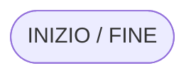
- Indica l'**inizio** o la **fine** di un algoritmo
- Ogni flow chart ha esattamente UN inizio e almeno UNA fine

**2. PROCESSO (Rettangolo)**
```mermaid
  flowchart TD;
      A[AREA = BASE × H]
```
- Rappresenta un'**operazione** o **istruzione**
- Calcoli, assegnazioni, operazioni matematiche
- Esempi: `X = 5`, `SOMMA = A + B`, `CONTATORE = CONTATORE + 1`

**3. INPUT/OUTPUT (Parallelogramma)**
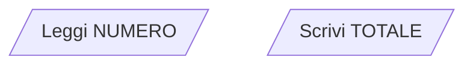
- Rappresenta **input** (lettura di dati)
- Rappresenta **output** (scrittura/stampa di risultati)
- Esempi: `Leggi N`, `Scrivi "Risultato"`, `Stampa MEDIA`

**4. DECISIONE (Rombo)**
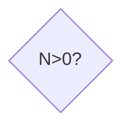
- Rappresenta una **condizione** o **test**
- Ha due uscite: VERO (SI/TRUE) e FALSO (NO/FALSE)
- La condizione è sempre una domanda con risposta SI/NO
- Esempi: `N > 0?`, `A = B?`, `SOMMA < 100?`

**5. FRECCE (Linee di Flusso)**
```
    │
    ↓
    →
    ←
    ↑
```
- Indicano il **flusso di esecuzione**
- Mostrano l'ordine in cui vengono eseguite le istruzioni
- Di solito vanno dall'alto verso il basso e da sinistra a destra

**6. CONNETTORI (Cerchi)**

Connettore in-page
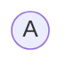
Connettore off-page

- Usati per **collegare** parti del flow chart quando le frecce si incrocerebbero
- Connettori con la stessa etichetta sono collegati
- Utili per mantenere il diagramma leggibile

#### Simboli Aggiuntivi (Meno Comuni)

**7. PREDEFINITO (Rettangolo con barre laterali)**
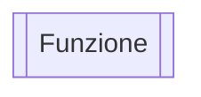
- Rappresenta una **funzione** o **procedura** predefinita


---

### 2.3 Regole per Disegnare Flow Chart (15 min)

#### Convenzioni Standard

1. **Direzione del flusso**: dall'alto verso il basso, da sinistra a destra
2. **Un solo inizio**: un unico terminatore "INIZIO"
3. **Una o più fine**: almeno un terminatore "FINE"
4. **Frecce chiare**: sempre indicare la direzione con frecce
5. **Etichette decisioni**: indicare chiaramente SI/NO o VERO/FALSO
6. **Testo conciso**: istruzioni brevi e chiare nei simboli
7. **No incroci**: evitare che le linee si incrocino (usare connettori)
8. **Allineamento**: mantenere i simboli allineati per leggibilità

#### Esempio Completo: Calcolare la Media di Due Numeri

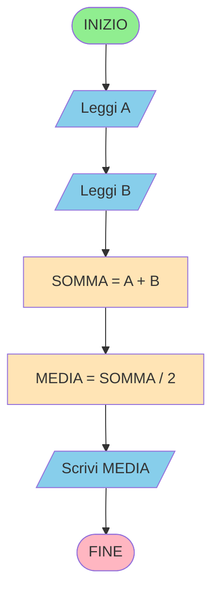

---

### 2.4 Costrutti Fondamentali (35 min)

I costrutti fondamentali sono i **mattoni** con cui si costruisce qualsiasi algoritmo. Secondo il **Teorema di Böhm-Jacopini** (1966), qualsiasi algoritmo può essere espresso usando solo tre costrutti di base.

#### 1. SEQUENZA

**Definizione:** Esecuzione di istruzioni una dopo l'altra, in ordine.

**Caratteristiche:**
- Le istruzioni vengono eseguite dall'alto verso il basso
- Ogni istruzione viene eseguita esattamente una volta
- Non ci sono scelte o ripetizioni

**Flow Chart - Esempio: Scambio di due variabili**
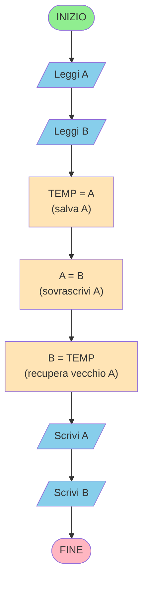

#### 2. SELEZIONE (o Alternativa)

**Definizione:** Esecuzione di istruzioni diverse in base a una condizione.

**Tipi di Selezione:**

**a) Selezione Semplice (IF)**
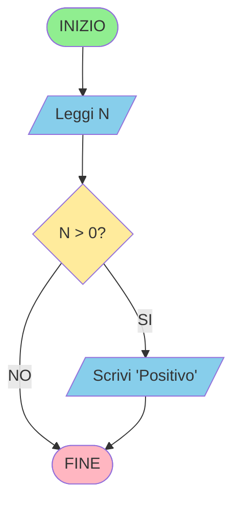

**b) Selezione Binaria (IF-ELSE)**
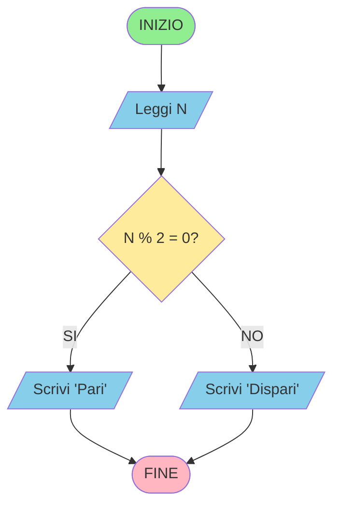

**c) Selezione Multipla (Nidificata)**


#### 3. ITERAZIONE (o Ciclo o Loop)

**Definizione:** Ripetizione di un blocco di istruzioni finché una condizione è vera.

**Tipi di Iterazione:**

**a) WHILE (Condizione all'inizio)**
- Controlla la condizione PRIMA di eseguire il blocco
- Se la condizione è falsa inizialmente, il blocco non viene mai eseguito

**Esempio: Contare da 1 a 5**
```mermaid
flowchart TD
    Start([INIZIO])
    Init[CONT = 1]
    Conn((●))
    Decision{CONT <= 5?}
    Output[/Scrivi CONT/]
    Increment[CONT = CONT + 1]
    End([FINE])
    
    Start --> Init
    Init --> Conn
    Conn --> Decision
    Decision -->|SI| Output
    Decision -->|NO| End
    Output --> Increment
    Increment --> Conn
    
    style Start fill:#90EE90
    style End fill:#FFB6C1
    style Init fill:#FFE4B5
    style Output fill:#87CEEB
    style Increment fill:#FFE4B5
    style Decision fill:#FFEB9C
    style Conn fill:#DDA0DD
```

**b) DO-WHILE (Condizione alla fine)**
- Esegue il blocco PRIMA di controllare la condizione
- Il blocco viene eseguito almeno una volta

**Esempio: Validazione input (ripeti finché valido)**
```mermaid
flowchart TD
    Start([INIZIO])
    Conn((●))
    Input[/Leggi N/]
    Decision{"N < 1<br/>OR<br/>N > 10?"}
    Error[/Scrivi 'Errore'/]
    End([FINE])
    
    Start --> Conn
    Conn --> Input
    Input --> Decision
    Decision -->|SI| Error
    Decision -->|NO| End
    Error --> Conn
    
    style Start fill:#90EE90
    style End fill:#FFB6C1
    style Input fill:#87CEEB
    style Error fill:#87CEEB
    style Decision fill:#FFEB9C
    style Conn fill:#DDA0DD
```

**c) FOR (Ciclo con contatore)**
- Usato quando si conosce in anticipo il numero di ripetizioni
- Combina inizializzazione, condizione e incremento

**Esempio: Somma dei primi N numeri**
```mermaid
flowchart TD
    Start([INIZIO])
    Input[/Leggi N/]
    InitSum[SOMMA = 0]
    InitI[I = 1]
    Conn((●))
    Decision{I <= N?}
    Process[SOMMA = SOMMA + I]
    Increment[I = I + 1]
    Output[/Scrivi SOMMA/]
    End([FINE])
    
    Start --> Input
    Input --> InitSum
    InitSum --> InitI
    InitI --> Conn
    Conn --> Decision
    Decision -->|SI| Process
    Decision -->|NO| Output
    Process --> Increment
    Increment --> Conn
    Output --> End
    
    style Start fill:#90EE90
    style End fill:#FFB6C1
    style Input fill:#87CEEB
    style Output fill:#87CEEB
    style InitSum fill:#FFE4B5
    style InitI fill:#FFE4B5
    style Process fill:#FFE4B5
    style Increment fill:#FFE4B5
    style Decision fill:#FFEB9C
    style Conn fill:#DDA0DD
```

---

### 2.5 Pseudocodice (20 min)

#### Cos'è lo Pseudocodice?

Lo **pseudocodice** è un linguaggio di descrizione degli algoritmi che sta a metà strada tra il linguaggio naturale e un linguaggio di programmazione.

#### Caratteristiche:
- Non è un linguaggio di programmazione vero
- Non ha una sintassi rigida
- È più strutturato del linguaggio naturale
- Facilita la traduzione in codice reale
- Indipendente dal linguaggio di programmazione

#### Parole Chiave Comuni

**Struttura base:**
```
INIZIO
    istruzioni
FINE
```

**Input/Output:**
```
LEGGI variabile
SCRIVI variabile
STAMPA "messaggio"
```

**Assegnamento:**
```
variabile ← valore
variabile = espressione
```

**Selezione:**
```
SE condizione ALLORA
    istruzioni
FINE SE

SE condizione ALLORA
    istruzioni1
ALTRIMENTI
    istruzioni2
FINE SE
```

**Iterazione:**
```
MENTRE condizione FARE
    istruzioni
FINE MENTRE

RIPETI
    istruzioni
FINCHÉ condizione

PER variabile DA inizio A fine FARE
    istruzioni
FINE PER
```

#### Esempi di Pseudocodice

**Esempio 1: Calcolare il fattoriale**
```
INIZIO
    LEGGI n
    fattoriale ← 1
    i ← 1
    MENTRE i <= n FARE
        fattoriale ← fattoriale * i
        i ← i + 1
    FINE MENTRE
    SCRIVI fattoriale
FINE
```

**Esempio 2: Trovare il massimo in un array**
```
INIZIO
    LEGGI n (dimensione array)
    PER i DA 0 A n-1 FARE
        LEGGI array[i]
    FINE PER
    
    max ← array[0]
    PER i DA 1 A n-1 FARE
        SE array[i] > max ALLORA
            max ← array[i]
        FINE SE
    FINE PER
    
    SCRIVI max
FINE
```

**Esempio 3: Numeri pari da 1 a N**
```
INIZIO
    LEGGI n
    i ← 2
    MENTRE i <= n FARE
        SCRIVI i
        i ← i + 2
    FINE MENTRE
FINE
```

---

### 2.6 Dal Flow Chart al Codice (10 min)

#### Processo di Traduzione

1. **Analizza il problema** → capisci cosa deve fare
2. **Disegna il flow chart** → visualizza la logica
3. **Scrivi lo pseudocodice** → struttura l'algoritmo
4. **Traduci in linguaggio** → scrivi il codice vero

#### Esempio Completo: Verifica se un numero è positivo, negativo o zero

**1. Problema:** Leggere un numero e dire se è positivo, negativo o zero.

**2. Flow Chart:**
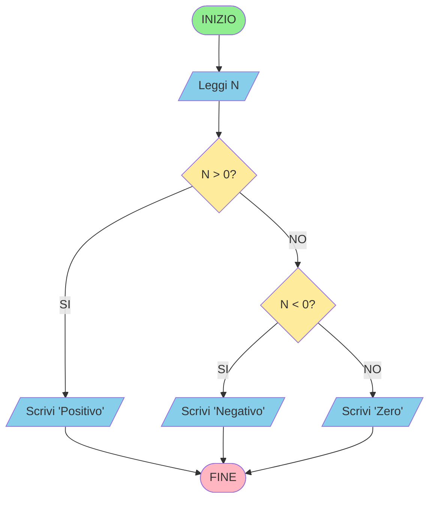

**3. Pseudocodice:**
```
INIZIO
    LEGGI numero
    SE numero > 0 ALLORA
        SCRIVI "Positivo"
    ALTRIMENTI SE numero < 0 ALLORA
        SCRIVI "Negativo"
    ALTRIMENTI
        SCRIVI "Zero"
    FINE SE
FINE
```

**4. Codice C (anticipazione):**
```c
#include <stdio.h>

int main() {
    int numero;
    printf("Inserisci un numero: ");
    scanf("%d", &numero);
    
    if (numero > 0) {
        printf("Positivo\n");
    } else if (numero < 0) {
        printf("Negativo\n");
    } else {
        printf("Zero\n");
    }
    
    return 0;
}
```

---

## PARTE PRATICA (2 ore)

### ESERCIZI GUIDATI

#### Esercizio 1: Disegnare Flow Chart Semplici (30 min)

**1.1** Disegna il flow chart per calcolare la somma di due numeri.

**Soluzione:**
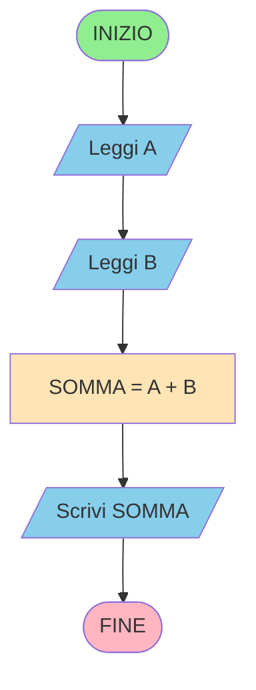

**1.2** Disegna il flow chart per determinare se un numero è pari.

**Soluzione:**
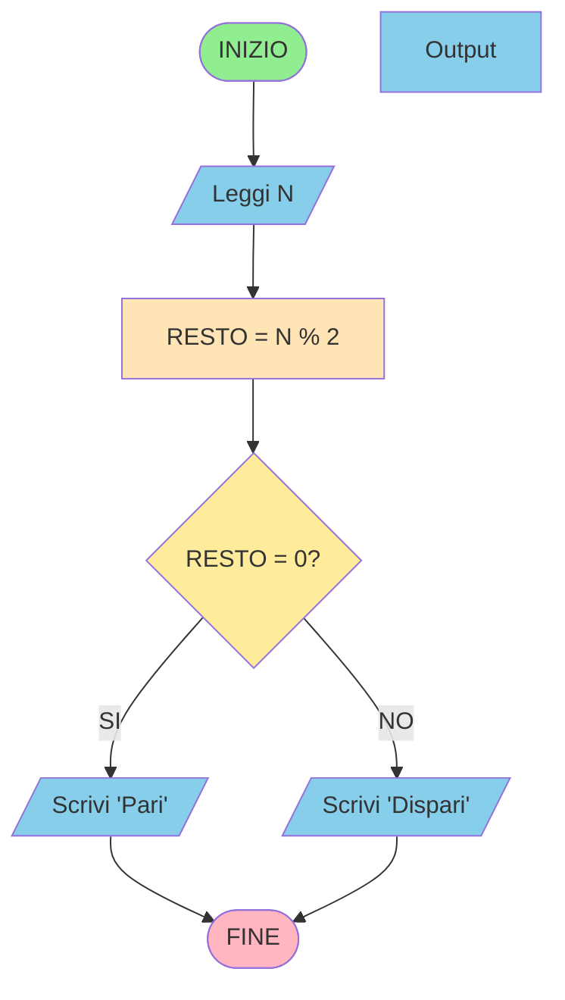

**1.3** Disegna il flow chart per trovare il maggiore tra due numeri.

**Soluzione:**
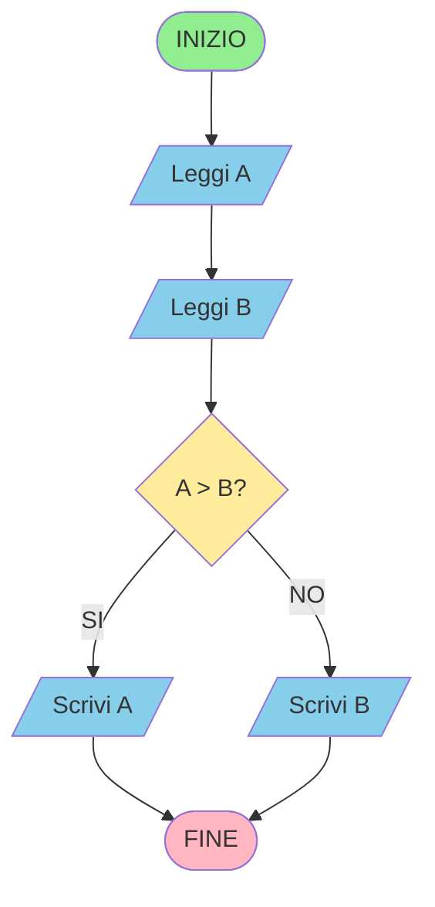

---

#### Esercizio 2: Flow Chart con Cicli (30 min)

**2.1** Disegna il flow chart per stampare i numeri da 1 a 10.

**Soluzione (con WHILE):**
```mermaid
flowchart TD
    Start([INIZIO])
    Init[I = 1]
    Conn((●))
    Decision{I <= 10?}
    Output[/Scrivi I/]
    Increment[I = I + 1]
    End([FINE])
    
    Start --> Init
    Init --> Conn
    Conn --> Decision
    Decision -->|SI| Output
    Decision -->|NO| End
    Output --> Increment
    Increment --> Conn
    
    style Start fill:#90EE90
    style End fill:#FFB6C1
    style Init fill:#FFE4B5
    style Output fill:#87CEEB
    style Increment fill:#FFE4B5
    style Decision fill:#FFEB9C
    style Conn fill:#DDA0DD
```

**2.2** Disegna il flow chart per calcolare la somma dei primi N numeri naturali.

**Soluzione:**
```mermaid
flowchart TD
    Start([INIZIO])
    Input[/Leggi N/]
    InitSum[SOMMA = 0]
    InitI[I = 1]
    Conn((●))
    Decision{I <= N?}
    Process[SOMMA = SOMMA + I]
    Increment[I = I + 1]
    Output[/Scrivi SOMMA/]
    End([FINE])
    
    Start --> Input
    Input --> InitSum
    InitSum --> InitI
    InitI --> Conn
    Conn --> Decision
    Decision -->|SI| Process
    Decision -->|NO| Output
    Process --> Increment
    Increment --> Conn
    Output --> End
    
    style Start fill:#90EE90
    style End fill:#FFB6C1
    style Input fill:#87CEEB
    style Output fill:#87CEEB
    style InitSum fill:#FFE4B5
    style InitI fill:#FFE4B5
    style Process fill:#FFE4B5
    style Increment fill:#FFE4B5
    style Decision fill:#FFEB9C
    style Conn fill:#DDA0DD
```

---

#### Esercizio 3: Pseudocodice (30 min)

**3.1** Scrivi lo pseudocodice per calcolare l'area di un cerchio.

**Soluzione:**
```
INIZIO
    COSTANTE PI = 3.14159
    LEGGI raggio
    area ← PI * raggio * raggio
    SCRIVI area
FINE
```

**3.2** Scrivi lo pseudocodice per determinare se un anno è bisestile.

**Soluzione:**
```
INIZIO
    LEGGI anno
    SE (anno % 400 = 0) ALLORA
        SCRIVI "Bisestile"
    ALTRIMENTI SE (anno % 100 = 0) ALLORA
        SCRIVI "Non bisestile"
    ALTRIMENTI SE (anno % 4 = 0) ALLORA
        SCRIVI "Bisestile"
    ALTRIMENTI
        SCRIVI "Non bisestile"
    FINE SE
FINE
```

**3.3** Scrivi lo pseudocodice per calcolare il fattoriale di un numero.

**Soluzione:**
```
INIZIO
    LEGGI n
    SE n < 0 ALLORA
        SCRIVI "Errore: numero negativo"
    ALTRIMENTI
        fattoriale ← 1
        i ← 1
        MENTRE i <= n FARE
            fattoriale ← fattoriale * i
            i ← i + 1
        FINE MENTRE
        SCRIVI fattoriale
    FINE SE
FINE
```

**3.4** Scrivi lo pseudocodice per trovare il minimo in una sequenza di N numeri.

**Soluzione:**
```
INIZIO
    LEGGI n
    LEGGI primo_numero
    minimo ← primo_numero
    
    PER i DA 2 A n FARE
        LEGGI numero
        SE numero < minimo ALLORA
            minimo ← numero
        FINE SE
    FINE PER
    
    SCRIVI minimo
FINE
```

---

#### Esercizio 4: Traduzione Flow Chart → Pseudocodice (30 min)

**4.1** Dato il seguente flow chart, scrivi il corrispondente pseudocodice.

Flow Chart: Tabellina di un numero
```mermaid
flowchart TD
    Start([INIZIO])
    Input[/Leggi N/]
    InitI[I = 1]
    Conn((●))
    Decision{I <= 10?}
    Process[RIS = N × I]
    Output[/Scrivi RIS/]
    Increment[I = I + 1]
    End([FINE])
    
    Start --> Input
    Input --> InitI
    InitI --> Conn
    Conn --> Decision
    Decision -->|SI| Process
    Decision -->|NO| End
    Process --> Output
    Output --> Increment
    Increment --> Conn
    
    style Start fill:#90EE90
    style End fill:#FFB6C1
    style Input fill:#87CEEB
    style Output fill:#87CEEB
    style InitI fill:#FFE4B5
    style Process fill:#FFE4B5
    style Increment fill:#FFE4B5
    style Decision fill:#FFEB9C
    style Conn fill:#DDA0DD
```

**Soluzione:**
```
INIZIO
    LEGGI n
    i ← 1
    MENTRE i <= 10 FARE
        risultato ← n * i
        SCRIVI risultato
        i ← i + 1
    FINE MENTRE
FINE
```

**4.2** Scrivi il pseudocodice per il seguente flow chart che conta i numeri positivi.

Flow Chart: Contare quanti numeri positivi in una sequenza di N numeri
```mermaid
flowchart TD
    Start([INIZIO])
    InputN[/Leggi N/]
    InitCont[CONT = 0]
    InitI[I = 1]
    Conn((●))
    Decision1{I <= N?}
    InputNum[/Leggi NUM/]
    Decision2{NUM > 0?}
    IncrCont[CONT = CONT + 1]
    IncrI[I = I + 1]
    Output[/Scrivi CONT/]
    End([FINE])
    
    Start --> InputN
    InputN --> InitCont
    InitCont --> InitI
    InitI --> Conn
    Conn --> Decision1
    Decision1 -->|SI| InputNum
    Decision1 -->|NO| Output
    InputNum --> Decision2
    Decision2 -->|SI| IncrCont
    Decision2 -->|NO| IncrI
    IncrCont --> IncrI
    IncrI --> Conn
    Output --> End
    
    style Start fill:#90EE90
    style End fill:#FFB6C1
    style InputN fill:#87CEEB
    style InputNum fill:#87CEEB
    style Output fill:#87CEEB
    style InitCont fill:#FFE4B5
    style InitI fill:#FFE4B5
    style IncrCont fill:#FFE4B5
    style IncrI fill:#FFE4B5
    style Decision1 fill:#FFEB9C
    style Decision2 fill:#FFEB9C
    style Conn fill:#DDA0DD
```

**Soluzione:**
```
INIZIO
    LEGGI n
    contatore ← 0
    PER i DA 1 A n FARE
        LEGGI numero
        SE numero > 0 ALLORA
            contatore ← contatore + 1
        FINE SE
    FINE PER
    SCRIVI contatore
FINE
```

**4.3** Scrivi il pseudocodice per validare un voto (deve essere tra 0 e 10).

**Soluzione:**
```
INIZIO
    RIPETI
        LEGGI voto
        SE voto < 0 O voto > 10 ALLORA
            SCRIVI "Voto non valido, riprova"
        FINE SE
    FINCHÉ voto >= 0 E voto <= 10
    
    SCRIVI "Voto accettato:", voto
FINE
```

---

### ESERCIZI AUTONOMI

#### Esercizio 5: Flow Chart Complessi (da svolgere in classe)

**5.1** Disegna il flow chart per un programma che legge 3 numeri e li stampa in ordine crescente.

**Suggerimenti:**
- Usa variabili A, B, C per i tre numeri
- Confronta a coppie e scambia se necessario
- Puoi usare variabili temporanee per lo scambio

**5.2** Disegna il flow chart per calcolare la media di N voti, escludendo il voto più basso e il voto più alto.

**Suggerimenti:**
- Leggi N voti
- Trova il minimo e il massimo
- Calcola la somma totale
- Sottrai min e max dalla somma
- Dividi per (N-2)

**5.3** Disegna il flow chart per verificare se un numero è primo.

**Suggerimenti:**
- Un numero è primo se divisibile solo per 1 e se stesso
- Controlla divisibilità da 2 fino a N-1 (o meglio, fino a √N)
- Se trovi un divisore, non è primo

---

#### Esercizio 6: Pseudocodice Avanzato

**6.1** Scrivi lo pseudocodice per la ricerca sequenziale di un elemento in un array.

**Specifiche:**
- Input: array di N elementi, elemento da cercare
- Output: posizione dell'elemento (o -1 se non trovato)

**6.2** Scrivi lo pseudocodice per invertire un array.

**Specifiche:**
- Input: array di N elementi
- Output: array con elementi in ordine inverso
- Suggerimento: scambia primo con ultimo, secondo con penultimo, ecc.

**6.3** Scrivi lo pseudocodice per il gioco "Indovina il numero".

**Specifiche:**
- Il computer "pensa" un numero tra 1 e 100
- L'utente ha 7 tentativi per indovinarlo
- Dopo ogni tentativo, il computer dice se il numero è più alto o più basso
- Se l'utente indovina, vince; altrimenti perde

---

### ESERCIZI DA SVOLGERE A CASA

**Homework 1:** Disegna il flow chart e scrivi lo pseudocodice per calcolare il massimo comun divisore (MCD) tra due numeri usando l'algoritmo di Euclide.
- Algoritmo: MCD(a,b) = MCD(b, a%b) finché b ≠ 0

**Homework 2:** Disegna il flow chart per convertire un numero decimale in binario.
- Suggerimento: dividi ripetutamente per 2 e memorizza i resti

**Homework 3:** Scrivi lo pseudocodice per ordinare un array di N numeri in ordine crescente (usa il Bubble Sort).
- Confronta elementi adiacenti e scambiali se non in ordine
- Ripeti finché non ci sono più scambi

**Homework 4:** Disegna il flow chart per calcolare la sequenza di Fibonacci fino all'N-esimo termine.
- Fibonacci: F(0)=0, F(1)=1, F(n)=F(n-1)+F(n-2)

**Homework 5:** Scrivi lo pseudocodice per un programma che gestisce un menu con 4 opzioni:
1. Calcola area cerchio
2. Calcola area rettangolo
3. Calcola area triangolo
4. Esci

---

## ESERCIZI DI ANALISI E CORREZIONE

### Esercizio 7: Trova gli Errori

**7.1** Il seguente flow chart ha degli errori logici. Individuali e correggili.

**Flow Chart Errato: Somma numeri positivi**
```mermaid
flowchart TD
    Start([INIZIO])
    InitSum[SOMMA = 0]
    Input[/Leggi N/]
    Decision{N > 0?}
    Process[SOMMA = SOMMA + N]
    End([FINE])
    
    Start --> InitSum
    InitSum --> Input
    Input --> Decision
    Decision -->|SI| Process
    Decision -->|NO| Input
    Process --> End
    
    style Start fill:#90EE90
    style End fill:#FFB6C1
    style Input fill:#87CEEB
    style InitSum fill:#FFE4B5
    style Process fill:#FFE4B5
    style Decision fill:#FFEB9C
```

**Problemi:**
1. Manca una condizione di uscita dal ciclo
2. Il flusso non è chiaro
3. Non si sa quanti numeri leggere

**Versione Corretta:**
```mermaid
flowchart TD
    Start([INIZIO])
    InitSum[SOMMA = 0]
    InputQuanti[/Leggi QUANTI/]
    InitI[I = 1]
    Conn((●))
    Decision1{I <= QUANTI?}
    InputN[/Leggi N/]
    Decision2{N > 0?}
    Process[SOMMA = SOMMA + N]
    IncrI[I = I + 1]
    Output[/Scrivi SOMMA/]
    End([FINE])
    
    Start --> InitSum
    InitSum --> InputQuanti
    InputQuanti --> InitI
    InitI --> Conn
    Conn --> Decision1
    Decision1 -->|SI| InputN
    Decision1 -->|NO| Output
    InputN --> Decision2
    Decision2 -->|SI| Process
    Decision2 -->|NO| IncrI
    Process --> IncrI
    IncrI --> Conn
    Output --> End
    
    style Start fill:#90EE90
    style End fill:#FFB6C1
    style InputQuanti fill:#87CEEB
    style InputN fill:#87CEEB
    style Output fill:#87CEEB
    style InitSum fill:#FFE4B5
    style InitI fill:#FFE4B5
    style Process fill:#FFE4B5
    style IncrI fill:#FFE4B5
    style Decision1 fill:#FFEB9C
    style Decision2 fill:#FFEB9C
    style Conn fill:#DDA0DD
```

**7.2** Correggi il seguente pseudocodice che dovrebbe calcolare la media di N numeri:

**Pseudocodice Errato:**
```
INIZIO
    LEGGI n
    somma ← 0
    PER i DA 1 A n FARE
        LEGGI numero
        somma ← numero
    FINE PER
    media ← somma / i
    SCRIVI media
FINE
```

**Errori:**
1. `somma ← numero` sovrascrive invece di sommare
2. `somma / i` usa i che vale n+1 dopo il ciclo
3. Dovrebbe dividere per n, non per i

**Pseudocodice Corretto:**
```
INIZIO
    LEGGI n
    somma ← 0
    PER i DA 1 A n FARE
        LEGGI numero
        somma ← somma + numero
    FINE PER
    media ← somma / n
    SCRIVI media
FINE
```

---

## APPROFONDIMENTI E CURIOSITÀ

### Storia dei Flow Chart

I diagrammi di flusso furono introdotti da **Frank Gilbreth** nel 1921 per documentare i processi industriali. Nel 1947, **Herman Goldstine** e **John von Neumann** li adattarono per la programmazione. Divennero standard con l'**ANSI** (American National Standards Institute) negli anni '60.

### Diagrammi di Nassi-Shneiderman

Alternativa ai flow chart tradizionali, usano blocchi rettangolari nidificati invece di frecce. Utili per evidenziare la programmazione strutturata.

### Unified Modeling Language (UML)

Nei progetti software moderni, i flow chart sono stati in parte sostituiti da diagrammi UML più sofisticati:
- Diagrammi di attività
- Diagrammi di sequenza
- Diagrammi di stato

### Tool Online per Flow Chart

- **draw.io** (diagrams.net): gratuito, potente
- **Lucidchart**: professionale, con collaborazione
- **Flowgorithm**: specifico per algoritmi, genera anche codice
- **Creately**: semplice e intuitivo
- **Visual Paradigm**: completo ma complesso

---

## RIEPILOGO COSTRUTTI

| Costrutto | Scopo | Quando usarlo |
|-----------|-------|---------------|
| **SEQUENZA** | Eseguire azioni in ordine | Sempre, è la base |
| **IF** | Decidere tra due alternative | Quando hai una scelta binaria |
| **IF nidificato** | Decidere tra più alternative | Quando hai più condizioni da verificare |
| **WHILE** | Ripetere finché condizione vera | Quando non sai quante iterazioni servono |
| **DO-WHILE** | Ripetere almeno una volta | Quando il blocco deve eseguirsi sempre almeno 1 volta |
| **FOR** | Ripetere N volte | Quando sai esattamente quante iterazioni servono |

---

## CHECKLIST PER DISEGNARE FLOW CHART

✓ Hai un solo terminatore "INIZIO"?  
✓ Hai almeno un terminatore "FINE"?  
✓ Tutte le frecce hanno una direzione chiara?  
✓ Ogni rombo decisionale ha esattamente 2 uscite (SI/NO)?  
✓ Non ci sono percorsi che portano a nulla (deadlock)?  
✓ Non ci sono cicli infiniti involontari?  
✓ I nomi delle variabili sono significativi?  
✓ Il flow chart è leggibile e ben spaziato?  
✓ Hai evitato incroci di linee (usando connettori)?  
✓ Ogni simbolo è usato correttamente?

---

## PUNTI CHIAVE DELLA LEZIONE

✓ I **flow chart** visualizzano gli algoritmi usando simboli standard  
✓ I **tre costrutti fondamentali** sono: sequenza, selezione, iterazione  
✓ Qualsiasi algoritmo può essere espresso con questi tre costrutti  
✓ Lo **pseudocodice** è un ponte tra algoritmo e codice  
✓ **WHILE** controlla prima, **DO-WHILE** controlla dopo  
✓ **FOR** è ideale quando conosci il numero di iterazioni  
✓ Disegnare flow chart aiuta a pensare prima di programmare  
✓ Dal flow chart al codice è un passaggio naturale

---

## PREPARAZIONE PER LA PROSSIMA LEZIONE

Nella prossima lezione studieremo:
- **Sistemi numerici**: decimale, binario, ottale, esadecimale
- **Conversioni tra basi** numeriche
- **Rappresentazione degli interi** in binario
- **Complemento a 2** per numeri negativi

Porta con te:
- Flow chart degli esercizi homework completati
- Calcolatrice (utile per conversioni)
- Domande sui costrutti o pseudocodice

---

## ESERCIZIO FINALE DI SINTESI

**Progetto Mini:** Disegna il flow chart completo e scrivi lo pseudocodice per un programma che:

1. Chiede all'utente quanti numeri vuole inserire (N)
2. Legge N numeri
3. Calcola e visualizza:
    - La somma di tutti i numeri
    - La media
    - Il numero più grande
    - Il numero più piccolo
    - Quanti numeri sono pari
    - Quanti numeri sono dispari

Questo esercizio riassume tutti i costrutti visti oggi!

**Suggerimento:** Dividi il problema in sottoproblemi più piccoli, crea un flow chart per ognuno, poi combinali.

---

## GLOSSARIO TECNICO

- **Algoritmo**: Sequenza di istruzioni per risolvere un problema
- **Flow Chart**: Rappresentazione grafica di un algoritmo
- **Costrutti**: Strutture di controllo fondamentali (sequenza, selezione, iterazione)
- **Pseudocodice**: Linguaggio semi-formale per descrivere algoritmi
- **Iterazione**: Ripetizione di un blocco di istruzioni (loop/ciclo)
- **Condizione**: Espressione logica che può essere vera o falsa
- **Terminatore**: Simbolo che indica inizio o fine di un algoritmo
- **Decisione**: Punto in cui l'algoritmo sceglie tra percorsi alternativi
- **Connettore**: Simbolo usato per collegare parti del flow chart
- **Nidificazione**: Inserimento di un costrutto dentro un altro

---

**Buon lavoro e ci vediamo alla prossima lezione!** 🚀